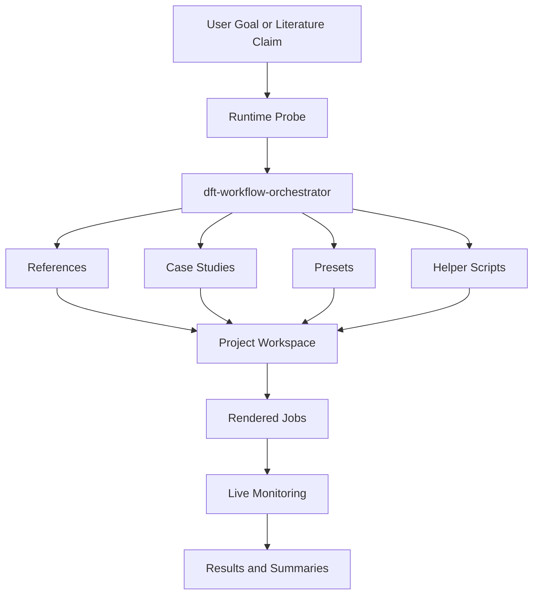
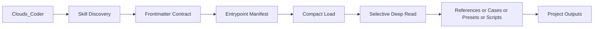
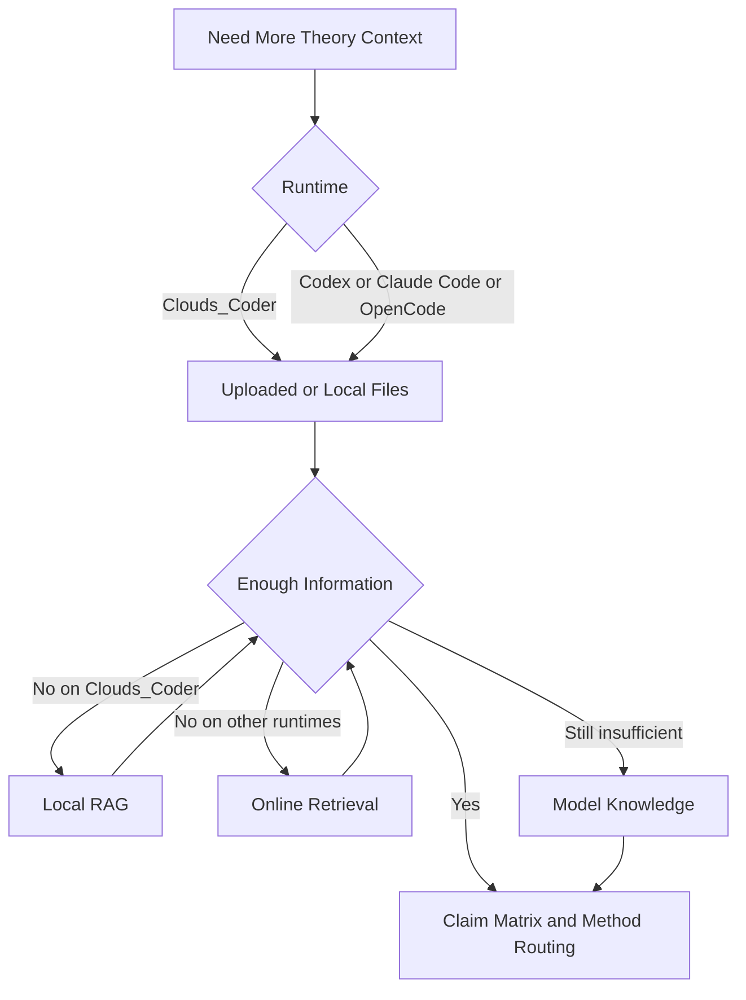
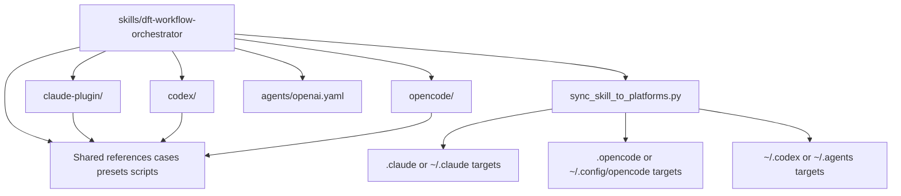
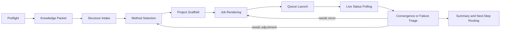

# DFT Skills

[中文](./README_zh.md) | [日本語](./README_ja.md)

Cross-platform DFT and VASP workflow skills for Clouds_Coder, Codex, Claude Code, and OpenCode.

This repository packages one reusable skill bundle, `dft-workflow-orchestrator`, plus its references, case studies, presets, and helper scripts. The goal is to turn literature-grounded computational-physics tasks into reproducible project packets without tying the workflow to one single agent runtime.

It is optimized first for the same ecosystem as [FonaTech/Clouds-Coder](https://github.com/FonaTech/Clouds-Coder), especially for Clouds_Coder discovery, compact skill loading, entrypoint-guided reads, and RAG-aware theory grounding. At the same time, the repository is packaged to remain portable across Codex, Claude Code, and OpenCode.

## GitHub Quick Links

- Optimized upstream runtime: [FonaTech/Clouds-Coder](https://github.com/FonaTech/Clouds-Coder)

## Optimization Positioning

- primary optimization target: `Clouds_Coder` in the `FonaTech/Clouds-Coder` ecosystem
- first-class portability targets: Codex, Claude Code, OpenCode
- design principle: Clouds-first optimization without sacrificing cross-platform skill portability

## Architecture Overview

The repository is organized as one Clouds-first skill bundle with platform-neutral scientific assets and runtime-specific mirrors around it.



## Key Framework Sub-Architectures

### 1. Clouds-First Discovery and On-Demand Loading

This is the path optimized for the same ecosystem as [FonaTech/Clouds-Coder](https://github.com/FonaTech/Clouds-Coder).



### 2. Knowledge Grounding Cascade

The collection chain stops early if the current tier is already sufficient for theory selection and experiment routing.



### 3. Cross-Platform Packaging Layout

The repository keeps GitHub-visible adapter directories, while the sync script materializes the actual hidden runtime install targets.



### 4. Execution and Live Monitoring Loop

The execution side is designed to keep background calculations observable instead of waiting blindly for job completion.



## What This Repository Contains

- a portable agent skill under `skills/dft-workflow-orchestrator/`
- workflow references for theory intake, method selection, project layout, and platform interop
- expanded engineering case studies covering catalysis, defects, transport, optics, mechanics, AIMD, plasma, LAMMPS coupling, COMSOL handoff, and more
- preset manifests for structure acquisition and project bootstrapping
- helper scripts for preflight checks, structure intake, job rendering, queue execution, run monitoring, and result summarization

## Supported Runtimes

- `Clouds_Coder`
- Codex
- Claude Code
- OpenCode

The primary skill file is:

- `skills/dft-workflow-orchestrator/SKILL.md`

## Repository Layout

```text
DFT_Skills/
├── README.md
├── INSTALL.md
├── LICENSE
├── THIRD_PARTY_AND_COPYRIGHT.md
├── claude-plugin/
├── codex/
├── opencode/
└── skills/
    └── dft-workflow-orchestrator/
        ├── SKILL.md
        ├── agents/
        ├── case-studies/
        ├── presets/
        ├── references/
        └── scripts/
```

## Installation

For the primary optimized runtime, `Clouds_Coder`, start with:

- [INSTALL.md](./INSTALL.md)

Platform-specific install helpers are also provided in:

- [`claude-plugin/INSTALL.md`](./claude-plugin/INSTALL.md)
- [`codex/INSTALL.md`](./codex/INSTALL.md)
- [`opencode/INSTALL.md`](./opencode/INSTALL.md)

The repository keeps these adapter directories visible so they can be uploaded to GitHub without relying on dot-prefixed folders. Actual installs still land in the runtime-native paths such as `.claude/`, `.opencode/`, `~/.codex/`, or `~/.agents/`.

## Clouds_Coder Compatibility

This package is structured to align with the actual `Clouds_Coder.py` skill loader and is tuned specifically for the loading and discovery behavior used by [FonaTech/Clouds-Coder](https://github.com/FonaTech/Clouds-Coder):

- YAML frontmatter includes `name`, `description`, `aliases`, `triggers`, `keywords`, `runtime_compat`
- `clouds_coder.preferred_tools`, `entrypoints`, and `runtime_contract` are present
- entrypoint resources are separated from the full body so the runtime can load them on demand
- the skill body is intentionally long enough to trigger Clouds compact-mode loading

## Cross-Platform Portability

Even though the repository is optimized first for Clouds, it is not Clouds-only.

- Codex support is carried by standard `SKILL.md` plus `agents/openai.yaml`
- Claude Code support is carried by visible `claude-plugin/` metadata plus installs into `.claude/skills/...` compatible paths
- OpenCode support is carried by visible `opencode/` helpers plus installs into `.opencode/skills/...` compatible paths
- the scientific workflow, cases, presets, and scripts remain platform-neutral and path-relative

You can verify this directly with:

```bash
python3 DFT_Skills/skills/dft-workflow-orchestrator/scripts/verify_clouds_compat.py
```

## VASP And Other Upstream Tools

This repository is an orchestration and documentation layer. It is not a redistribution of VASP or any other third-party simulation package.

In particular:

- no VASP source code or binary is included
- no `POTCAR` or PAW dataset is included
- no official VASP manual mirror, portal dump, or copied wiki archive is included
- helper scripts assume the user already has a separately licensed local installation where required

See the full legal and boundary document here:

- [THIRD_PARTY_AND_COPYRIGHT.md](./THIRD_PARTY_AND_COPYRIGHT.md)

## License

The original repository content is released under:

- [MIT](./LICENSE)

That MIT grant applies only to the original content of this repository. Third-party software, websites, datasets, user uploads, and separately licensed executables remain under their own terms.

## Reference Pages Used For VASP-Facing Packaging

These official pages were used as boundary references while packaging the VASP-facing parts of this repository:

- <https://www.vasp.at/>
- <https://www.vasp.at/home/wiki/>
- <https://www.vasp.at/info/faq/public_domain/>
- <https://www.vasp.at/info/faq/purchase_vasp/>
- <https://www.vasp.at/info/faq/vasp_access/>
- <https://www.vasp.at/wiki/index.php/POTCAR>
- <https://www.vasp.at/wiki/index.php/Preparing_a_POTCAR>
- <https://www.vasp.at/wiki/index.php/Nudged_elastic_bands>
- <https://www.vasp.at/wiki/index.php/Optical_properties>
- <https://www.vasp.at/wiki/Berry_phases_and_finite_electric_fields>
- <https://www.vasp.at/wiki/Molecular_dynamics_calculations?redirect=no&title=Molecular_dynamics_calculations>

Those pages remain the property of their respective owners and are linked here as references only.
