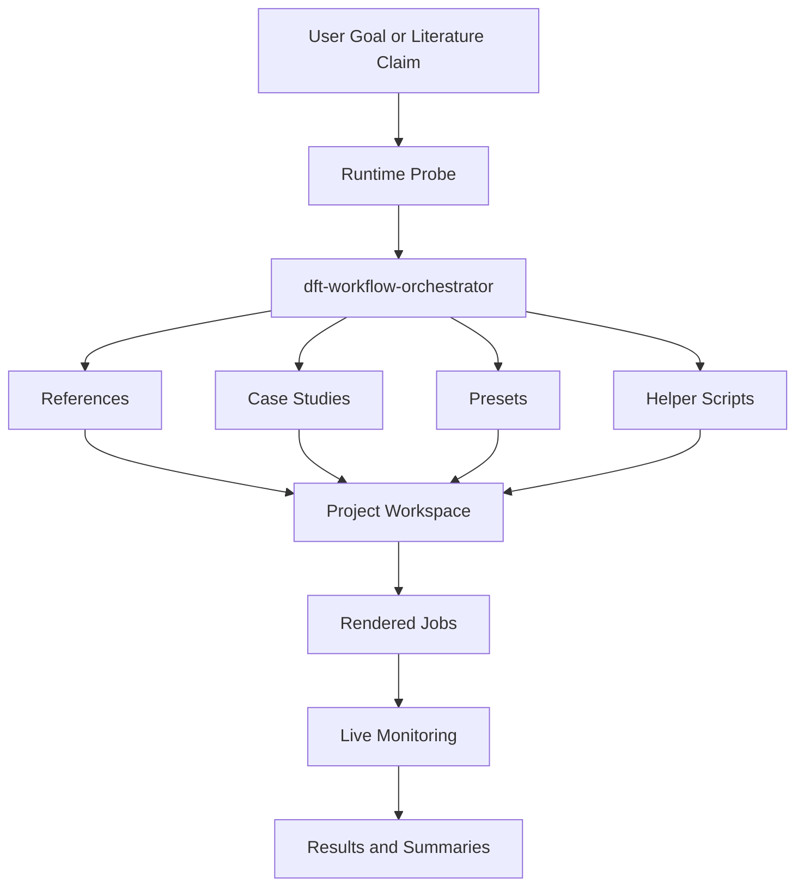
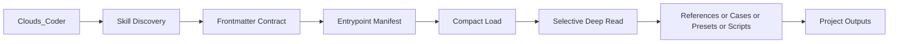
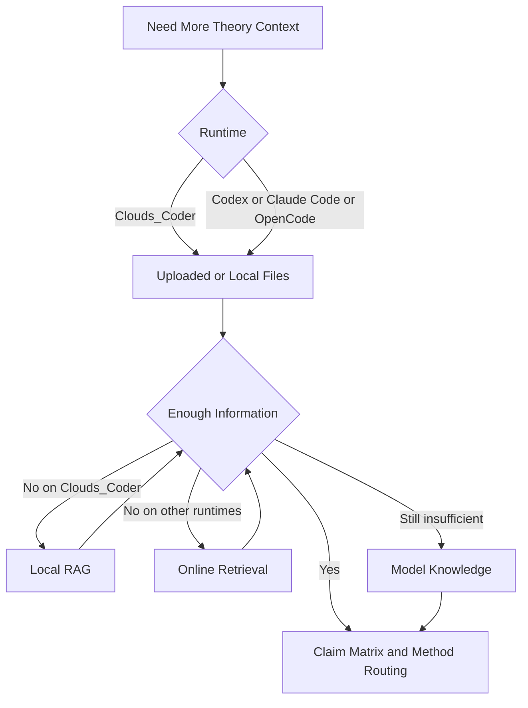
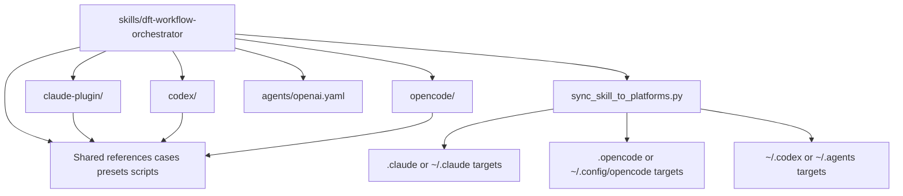
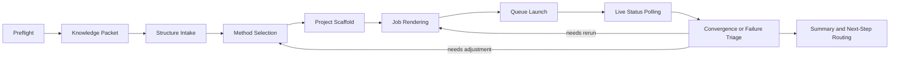

# DFT Skills

[English](./README.md) | [中文](./README_zh.md)

Clouds_Coder、Codex、Claude Code、OpenCode 向けのクロスプラットフォーム DFT / VASP workflow skills リポジトリです。

本リポジトリには、再利用可能な中核 skill バンドル `dft-workflow-orchestrator` と、それに対応する references、case studies、presets、scripts が含まれます。文献に基づく計算物理・計算材料タスクを、実行可能で再現可能なワークフローとして整理することが目的です。

本リポジトリは、同系統エコシステムである [FonaTech/Clouds-Coder](https://github.com/FonaTech/Clouds-Coder) 向けにまず最適化されています。特に Clouds_Coder の skill discovery、オンデマンド読み込み、entrypoint ベースの参照、RAG 優先の理論整理、実行境界の制御に合わせています。その一方で、Codex、Claude Code、OpenCode でも利用できるように移植性を維持しています。

## GitHub クイックリンク

- 優先最適化対象の上流ランタイム: [FonaTech/Clouds-Coder](https://github.com/FonaTech/Clouds-Coder)

## 最適化ポジション

- 第一の最適化対象: `FonaTech/Clouds-Coder` エコシステムの `Clouds_Coder`
- 第一級の対応対象: Codex、Claude Code、OpenCode
- 設計原則: Clouds 優先で最適化しつつ、skill のクロスプラットフォーム移植性を損なわない

## アーキテクチャ概要

本リポジトリは 1 つの中核 skill を中心に構成され、周囲にプラットフォーム非依存の scientific assets を置き、`Clouds_Coder` 向けを優先最適化しています。



## 主要フレームワークのサブアーキテクチャ

### 1. Clouds 優先の discovery とオンデマンド読み込み

この系統は [FonaTech/Clouds-Coder](https://github.com/FonaTech/Clouds-Coder) と同系のランタイム向け最適化を表します。



### 2. 知識収集と理論 grounding の連鎖

現在の階層で十分な情報が得られた時点で、以降の収集は止める設計です。



### 3. クロスプラットフォームのパッケージ配置

リポジトリ内では GitHub で見える adapter ディレクトリを使い、同期スクリプトが実際の隠しランタイムディレクトリへ展開します。



### 4. 実行とライブ監視ループ

バックグラウンド計算中も状態を継続観測し、逸脱や失敗を method 側または job 側へ即時に返す構成です。



## このリポジトリに含まれるもの

- `skills/dft-workflow-orchestrator/` 配下の中核 agent skill
- theory intake、method selection、project layout、platform interop などの workflow 参考資料
- 触媒、欠陥、移動障壁、バンド構造、光学、力学、AIMD、plasma、LAMMPS、COMSOL などを含む拡張 case study 群
- 構造取得とプロジェクト立ち上げのための preset manifests
- preflight、structure intake、job rendering、queue execution、run monitoring、result summarization 用の補助スクリプト

## 対応ランタイム

- `Clouds_Coder`
- Codex
- Claude Code
- OpenCode

主 skill ファイル:

- `skills/dft-workflow-orchestrator/SKILL.md`

## リポジトリ構成

```text
DFT_Skills/
├── README.md
├── README_zh.md
├── README_ja.md
├── INSTALL.md
├── LICENSE
├── THIRD_PARTY_AND_COPYRIGHT.md
├── claude-plugin/
├── codex/
├── opencode/
└── skills/
    └── dft-workflow-orchestrator/
        ├── SKILL.md
        ├── agents/
        ├── case-studies/
        ├── presets/
        ├── references/
        └── scripts/
```

## インストール

最優先の最適化対象である `Clouds_Coder` を使う場合は、まず次を参照してください。

- [INSTALL.md](./INSTALL.md)

他プラットフォーム向けの導入メモ:

- [`claude-plugin/INSTALL.md`](./claude-plugin/INSTALL.md)
- [`codex/INSTALL.md`](./codex/INSTALL.md)
- [`opencode/INSTALL.md`](./opencode/INSTALL.md)

GitHub 上で扱いやすくするため、リポジトリ内では `claude-plugin/`、`codex/`、`opencode/` を可視ディレクトリとして置いています。実際のインストール先は引き続き `.claude/`、`.opencode/`、`~/.codex/`、`~/.agents/` などのランタイム標準パスです。

## Clouds_Coder 向け最適化

本リポジトリは、[FonaTech/Clouds-Coder](https://github.com/FonaTech/Clouds-Coder) の `Clouds_Coder.py` が使う実際の skill loader に合わせて構成されています。

- frontmatter に `name`、`description`、`aliases`、`triggers`、`keywords`、`runtime_compat` を含む
- `clouds_coder.preferred_tools`、`entrypoints`、`runtime_contract` を含む
- resources を entrypoints と attachments に分け、必要なファイルだけを段階的に読める
- skill body は Clouds の compact-mode load を発動できる長さに調整済み

互換性確認:

```bash
python3 DFT_Skills/skills/dft-workflow-orchestrator/scripts/verify_clouds_compat.py
```

## 他プラットフォームへの適合性

Clouds 向けに最適化されてはいますが、Clouds 専用にはしていません。

- Codex は標準 `SKILL.md` と `agents/openai.yaml` で対応
- Claude Code は可視の `claude-plugin/` メタデータと `.claude/skills/...` への配置で対応
- OpenCode は可視の `opencode/` 補助ディレクトリと `.opencode/skills/...` への配置で対応
- scientific workflow、case、preset、script は相対パス前提で、プラットフォーム非依存を維持

## VASP と第三者コンテンツの境界

本リポジトリは workflow / orchestration / packaging 層であり、VASP 本体ではありません。第三者シミュレーションソフトウェアの再配布も行いません。

特に:

- VASP のソースコードやバイナリは含みません
- `POTCAR` や PAW データは含みません
- 公式 VASP manual、portal 配布物、公式 wiki アーカイブをミラーしません
- スクリプトは、ユーザーが適法に取得したローカル環境の利用を前提とします

詳細な境界文書:

- [THIRD_PARTY_AND_COPYRIGHT.md](./THIRD_PARTY_AND_COPYRIGHT.md)

## ライセンス

リポジトリのオリジナル内容は以下で公開されています。

- [MIT](./LICENSE)

この MIT はリポジトリのオリジナル内容のみに適用され、第三者ソフトウェア、ウェブサイト、データセット、アップロード資料、別ライセンスの実行ファイルには適用されません。
