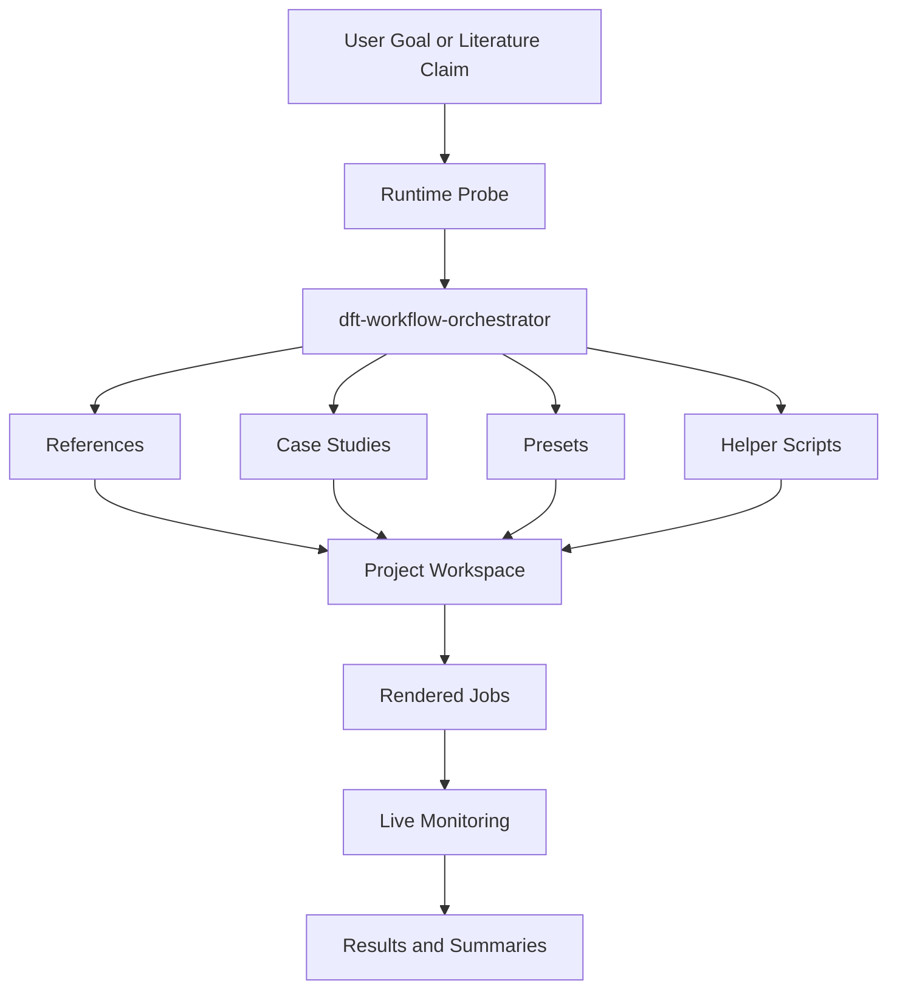
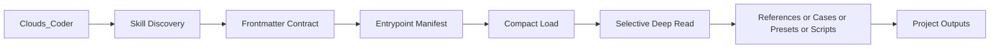
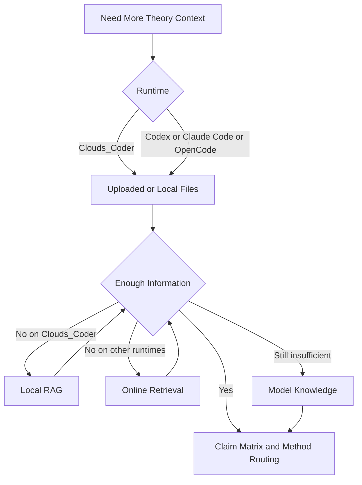
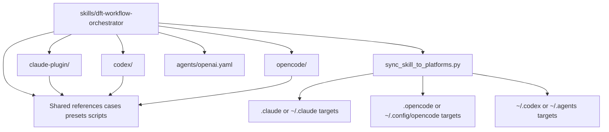
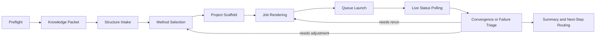

# DFT Skills

[English](./README.md) | [日本語](./README_ja.md)

面向 Clouds_Coder、Codex、Claude Code、OpenCode 的跨平台 DFT / VASP workflow skills。

本仓库提供一个可复用的核心 skill 包 `dft-workflow-orchestrator`，以及与之配套的 references、case studies、presets 和 scripts，用于把文献驱动的计算物理 / 计算材料任务整理成可执行、可复现的工程化工作流。

本仓库首先针对同源生态的 [FonaTech/Clouds-Coder](https://github.com/FonaTech/Clouds-Coder) 做专门优化，尤其是面向 Clouds_Coder 的技能发现、按需加载、entrypoint 导航、RAG 优先级和运行边界控制。同时，它也保持对 Codex、Claude Code、OpenCode 的适配性，不做单平台绑定。

## GitHub 快速跳转

- 优先适配的上游运行时仓库：[FonaTech/Clouds-Coder](https://github.com/FonaTech/Clouds-Coder)

## 优化定位

- 首要优化目标：`FonaTech/Clouds-Coder` 生态中的 `Clouds_Coder`
- 一等适配目标：Codex、Claude Code、OpenCode
- 设计原则：以 Clouds 为优先优化对象，同时保持 skill 的跨平台可移植性

## 架构总览

本仓库以一个核心 skill 为中心组织，外围挂接平台无关的 scientific assets，并针对 `Clouds_Coder` 做优先优化。



## 关键框架子架构图

### 1. Clouds 优先的发现与按需加载

这一层对应与 [FonaTech/Clouds-Coder](https://github.com/FonaTech/Clouds-Coder) 同源生态的优先适配路径。



### 2. 知识收集与理论归因链路

只要当前节点的信息已经足够支持理论判断和实验编排，就会提前停止继续收集。



### 3. 跨平台封装与镜像布局

仓库内保持 GitHub 可见的适配目录，再由同步脚本落地到各平台实际使用的隐藏运行时目录。



### 4. 执行与后台监控回路

这一层的目标是在后台计算运行时持续拉取状态、识别偏离、并及时回到方法或作业层做修正。



## 仓库包含内容

- `skills/dft-workflow-orchestrator/` 下的核心 agent skill
- theory intake、method selection、project layout、platform interop 等 workflow 参考资料
- 大幅扩充的工程案例库，覆盖催化、缺陷、迁移、能带、光学、力学、AIMD、plasma、LAMMPS、COMSOL 等方向
- 用于结构获取和项目起步的 preset manifests
- 用于 preflight、structure intake、job render、queue execution、run monitoring、result summary 的辅助脚本

## 支持的平台

- `Clouds_Coder`
- Codex
- Claude Code
- OpenCode

主 skill 文件位于：

- `skills/dft-workflow-orchestrator/SKILL.md`

## 仓库结构

```text
DFT_Skills/
├── README.md
├── README_zh.md
├── README_ja.md
├── INSTALL.md
├── LICENSE
├── THIRD_PARTY_AND_COPYRIGHT.md
├── claude-plugin/
├── codex/
├── opencode/
└── skills/
    └── dft-workflow-orchestrator/
        ├── SKILL.md
        ├── agents/
        ├── case-studies/
        ├── presets/
        ├── references/
        └── scripts/
```

## 安装

如果你使用的是本仓库优先优化的平台 `Clouds_Coder`，先看：

- [INSTALL.md](./INSTALL.md)

其他平台安装说明：

- [`claude-plugin/INSTALL.md`](./claude-plugin/INSTALL.md)
- [`codex/INSTALL.md`](./codex/INSTALL.md)
- [`opencode/INSTALL.md`](./opencode/INSTALL.md)

为了方便 GitHub 展示和手动上传，仓库内使用可见目录 `claude-plugin/`、`codex/`、`opencode/`。真正安装到平台时，仍然会落到 `.claude/`、`.opencode/`、`~/.codex/`、`~/.agents/` 等运行时原生路径。

## Clouds_Coder 专门适配点

本仓库已经按 `Clouds_Coder.py` 的真实 skill loader 行为做了对齐，并特别适配了 [FonaTech/Clouds-Coder](https://github.com/FonaTech/Clouds-Coder) 这一路径：

- frontmatter 中包含 `name`、`description`、`aliases`、`triggers`、`keywords`、`runtime_compat`
- 包含 `clouds_coder.preferred_tools`、`entrypoints`、`runtime_contract`
- 资源被拆分为 entrypoints 与 attachments，支持按需读取，而不是一次性粗暴展开
- skill body 长度被控制到可触发 Clouds compact-mode load，便于先加载 contract 和 resource manifest，再按需深读

可以直接运行兼容性检查：

```bash
python3 DFT_Skills/skills/dft-workflow-orchestrator/scripts/verify_clouds_compat.py
```

## 其他平台适配性

虽然本仓库首先为 Clouds 优化，但并不依赖 Clouds 专属机制才能工作。

- Codex 通过标准 `SKILL.md` 和 `agents/openai.yaml` 适配
- Claude Code 通过可见的 `claude-plugin/` 元数据配合 `.claude/skills/...` 安装路径适配
- OpenCode 通过可见的 `opencode/` 安装辅助目录配合 `.opencode/skills/...` 路径适配
- 核心 scientific workflow、case、preset、script 均保持相对路径和平台中立

## VASP 与第三方边界

本仓库是 workflow / orchestration / packaging 层，不是 VASP 本体，也不重新分发第三方模拟软件。

特别是：

- 不包含 VASP 源码或二进制
- 不包含 `POTCAR` 或 PAW 数据
- 不镜像官方 VASP manual、portal 下载物或官方 wiki 存档
- 脚本只会调用用户本地已合法获取的安装

完整边界说明见：

- [THIRD_PARTY_AND_COPYRIGHT.md](./THIRD_PARTY_AND_COPYRIGHT.md)

## 许可证

仓库原创内容采用：

- [MIT](./LICENSE)

这个 MIT 只覆盖本仓库原创内容，不覆盖第三方软件、网页、数据集、用户上传资料和单独授权的可执行文件。
